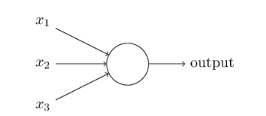
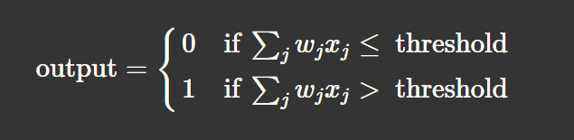
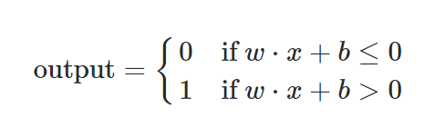
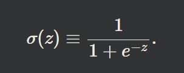
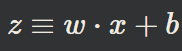
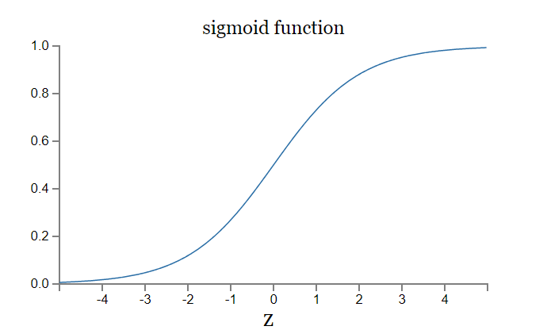

# **Task 13 Individual**

#### This README will contain a Summary for the important concepts i have learnt throught the in Michael Nielsen’s Neural Networks and Deep Learning book(chapter 1)

---
---
# Summary

## Artificial neuron  
- An artificial neuron is the fundamental simplest unit in artificial neural networks, inspired by the biological neurons in the human brain.  

- The simplest mathematical unit of an artificial neuron contains: several inputs, with corresponding several weights and gives an output by multpying the weights by the inputs.

## Perceptrons

A perceptron is a simple exapmle of an artifical neuron.

So how do perceptrons work? A perceptron takes several binary inputs, x1,x2,…, and produces a single binary output  

The neuron's output, 0 or 1, is determined by whether the weighted sum ∑jWjXj is less than or greater than some threshold value.  

We then move the threshold to the other side of the inequality to replace it by what's known as the perceptron's bias, b≡−threshold. Using the bias instead of the threshold, the perceptron rule can be rewritten:  

### So in conclusion you can think of the **Perceptron** as a **binary classifier**. Which means that when given an input we set the output to one of two known classes.

## Sigmoid Neuron

If we had a neural network of perceptrons any small change in the weights or bias of any single perceptron in the network can sometimes cause the output of that perceptron to completely flip.  
We can overcome that problem by introducing a new type of artificial neuron called a sigmoid neuron. Sigmoid neurons are similar to perceptrons, but modified so that small changes in their weights and bias cause only a small change in their output. That's the crucial fact which will allow a network of sigmoid neurons to learn.  

-  A sigmoid neuron key feature is the use of the sigmoid activation function, which transforms the neuron's input into an output that ranges between 0 and 1.

- Just like a perceptron, the sigmoid neuron has inputs, x1,x2,…. But instead of being just 0 or 1, these inputs can also take on any values between 0 and 1. So, for instance, 0.638… is a valid input for a sigmoid neuron. 

The sigmoid activation function is defined as follows:  

such that:  

We can plot the sigmoid activation function as follow:

## Gradient Descent
- it is an optimization algorithm used to minimize a function by iteratively moving towards the function's global minimum.

### Goal:
- Find the point where the function's output is minimized (e.g., minimizing loss in machine learning).

### Process:

- Begin at a random point on the function's surface.
- Compute Gradient: Calculate the slope (derivative) of the function at that point.
- Update Parameters: Move in the opposite direction of the gradient. Learning Rate Determines how big each step is.

## There is more documentation is the frame work notebook itself
